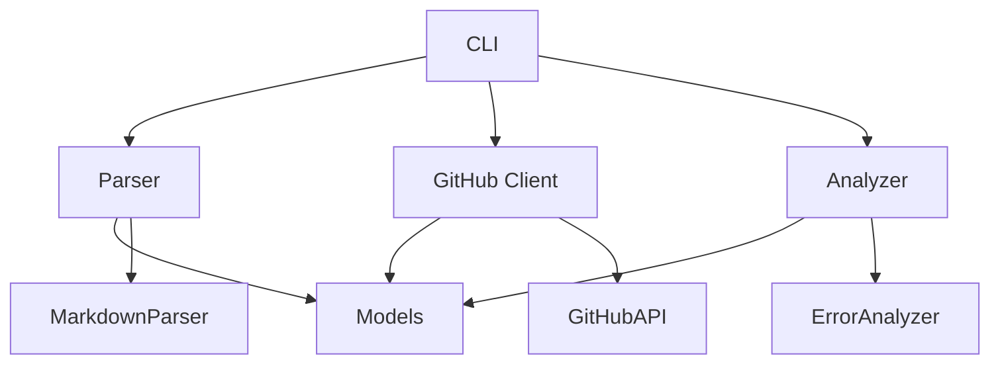

# Contributing to mdiss

Dziękujemy za zainteresowanie współpracą z projektem mdiss! 🎉

## 🚀 Quick Start dla kontrybutorów

```bash
# 1. Fork repozytorium na GitHub

# 2. Sklonuj swój fork
git clone https://github.com/YOUR_USERNAME/mdiss.git
cd mdiss

# 3. Zainstaluj środowisko deweloperskie
make dev

# 4. Uruchom testy
make test

# 5. Stwórz branch dla swojej funkcji
git checkout -b feature/amazing-feature

# 6. Wprowadź zmiany i commituj
git commit -m "feat: add amazing feature"

# 7. Wyślij pull request
git push origin feature/amazing-feature
```

## 📋 Typy kontrybuji

Chętnie przyjmujemy różne typy kontrybuji:

- 🐛 **Bug fixes** - Naprawy błędów
- ✨ **New features** - Nowe funkcjonalności
- 📚 **Documentation** - Ulepszenia dokumentacji
- 🧪 **Tests** - Dodatkowe testy
- 🔧 **Refactoring** - Usprawnienia kodu
- 🌍 **Translations** - Tłumaczenia
- 📊 **Examples** - Przykłady użycia

## 🛠️ Development Setup

### Wymagania

- Python 3.8+
- Poetry
- Git
- Make (opcjonalnie)

### Instalacja środowiska

```bash
# Klonowanie repozytorium
git clone https://github.com/wronai/mdiss.git
cd mdiss

# Instalacja zależności deweloperskich
poetry install --with dev,docs

# Aktywacja środowiska
poetry shell

# Instalacja pre-commit hooks
make install-hooks
```

### Struktura projektu

```
mdiss/
├── mdiss/                  # Kod źródłowy
│   ├── __init__.py        # Inicjalizacja pakietu
│   ├── cli.py             # Interfejs CLI
│   ├── parser.py          # Parser markdown
│   ├── github_client.py   # Klient GitHub API
│   ├── analyzer.py        # Analizator błędów
│   └── models.py          # Modele danych
├── tests/                 # Testy
│   ├── test_*.py         # Pliki testów
│   └── fixtures/         # Dane testowe
├── docs/                  # Dokumentacja
├── examples/              # Przykłady użycia
└── Makefile              # Zadania deweloperskie
```

## 🧪 Testowanie

### Uruchamianie testów

```bash
# Wszystkie testy
make test

# Tylko testy jednostkowe
make test-unit

# Tylko testy integracyjne
make test-integration

# Testy z pokryciem kodu
make test-coverage

# Testy verbose
make test-verbose
```

### Pisanie testów

- Każda nowa funkcja musi mieć testy
- Utrzymuj 100% pokrycie kodu
- Używaj fixtures z `tests/conftest.py`
- Dodaj markery pytest (`@pytest.mark.unit`, `@pytest.mark.integration`)

Przykład testu:

```python
import pytest
from mdiss.parser import MarkdownParser


class TestNewFeature:
    """Testy nowej funkcji."""
    
    def test_basic_functionality(self):
        """Test podstawowej funkcjonalności."""
        parser = MarkdownParser()
        result = parser.new_method()
        assert result is not None
    
    @pytest.mark.integration
    def test_integration_with_github(self, github_config):
        """Test integracji z GitHub."""
        # Test integration logic
        pass
```

## 🎨 Code Style

### Narzędzia formatowania

```bash
# Formatowanie kodu
make format

# Sprawdzanie formatowania
make format-check

# Sprawdzanie jakości kodu
make lint

# Sprawdzanie typów
poetry run mypy mdiss/

# Sprawdzanie bezpieczeństwa
poetry run bandit -r mdiss/
```

### Wytyczne stylu

- **Black** - automatyczne formatowanie kodu
- **isort** - sortowanie importów
- **flake8** - linting
- **mypy** - type checking
- Używaj type hints wszędzie gdzie to możliwe
- Dokumentuj funkcje i klasy w stylu Google docstrings

Przykład kodu:

```python
from typing import List, Optional

def process_commands(
    commands: List[FailedCommand], 
    skip_errors: bool = False
) -> Optional[List[str]]:
    """
    Przetwarza listę poleceń.
    
    Args:
        commands: Lista nieudanych poleceń do przetworzenia
        skip_errors: Czy pomijać błędy podczas przetwarzania
        
    Returns:
        Lista identyfikatorów przetworzonych poleceń lub None przy błędzie
        
    Raises:
        ValueError: Gdy lista poleceń jest pusta
    """
    if not commands:
        raise ValueError("Lista poleceń nie może być pusta")
    
    # Implementation here
    return []
```

## 📝 Commit Messages

Używamy [Conventional Commits](https://www.conventionalcommits.org/):

```
<type>[optional scope]: <description>

[optional body]

[optional footer(s)]
```

### Typy commitów

- `feat:` - nowa funkcjonalność
- `fix:` - naprawa błędu
- `docs:` - zmiany w dokumentacji
- `style:` - formatowanie, brakujące średniki, etc
- `refactor:` - refactoring kodu
- `test:` - dodanie lub modyfikacja testów
- `chore:` - aktualizacja zadań buildu, konfiguracji, etc

### Przykłady

```bash
feat: add support for GitLab issues
fix: handle timeout errors in GitHub API
docs: update installation guide
test: add integration tests for parser
refactor: extract error analysis logic
chore: update dependencies
```

## 🔄 Pull Request Process

### Przed utworzeniem PR

1. **Sprawdź issues** - czy problem już nie jest zgłoszony
2. **Utwórz issue** - jeśli nie istnieje, opisz problem/funkcję
3. **Fork repository** - utwórz swój fork
4. **Utwórz branch** - `feature/nazwa` lub `fix/nazwa`
5. **Wprowadź zmiany** - małe, atomowe commity
6. **Uruchom testy** - `make ci`
7. **Aktualizuj dokumentację** - jeśli potrzeba

### Template PR

```markdown
## Opis

Krótki opis wprowadzonych zmian.

## Typ zmiany

- [ ] Bug fix (non-breaking change która naprawia błąd)
- [ ] New feature (non-breaking change która dodaje funkcjonalność)
- [ ] Breaking change (fix lub feature który zmienia istniejące API)
- [ ] Documentation update

## Jak zostało przetestowane?

Opisz testy które zostały przeprowadzone.

## Checklist

- [ ] Kod jest zgodny z style guide projektu
- [ ] Przeprowadziłem self-review kodu
- [ ] Skomentowałem kod w trudnych do zrozumienia miejscach
- [ ] Zmiany w dokumentacji zostały wprowadzone
- [ ] Zmiany nie generują nowych ostrzeżeń
- [ ] Dodałem testy które potwierdzają działanie poprawki
- [ ] Nowe i istniejące testy przechodzą lokalnie
```

### Review Process

1. **Automatyczne sprawdzenia** - CI musi przejść
2. **Code review** - co najmniej jeden maintainer
3. **Testy** - wszystkie muszą przechodzić
4. **Dokumentacja** - musi być aktualna
5. **Squash and merge** - merge po aprobacie

## 🐛 Zgłaszanie błędów

### Issue Template

```markdown
## Opis błędu

Jasny i zwięzły opis błędu.

## Kroki reprodukcji

1. Przejdź do '...'
2. Kliknij na '...'
3. Przewiń w dół do '...'
4. Zobacz błąd

## Oczekiwane zachowanie

Jasny opis tego co powinno się stać.

## Rzeczywiste zachowanie

Jasny opis tego co się dzieje.

## Screenshots

Jeśli dotyczy, dodaj screenshots.

## Środowisko

- OS: [np. Ubuntu 20.04]
- Python: [np. 3.11]
- mdiss: [np. 1.0.60]
- Sposób instalacji: [pip/poetry/source]

## Dodatkowy kontekst

Dodaj inne informacje o problemie.
```

### Debugowanie

```bash
# Uruchom z verbose logami
mdiss --verbose analyze file.md

# Sprawdź informacje o środowisku
make env-info

# Uruchom w trybie debug
python -m pdb -m mdiss analyze file.md
```

## ✨ Proponowanie nowych funkcji

### Feature Request Template

```markdown
## Problem

Jasny opis problemu który ta funkcja ma rozwiązać.

## Proponowane rozwiązanie

Jasny opis tego czego chcesz.

## Alternatywy

Jasny opis alternatywnych rozwiązań które rozważałeś.

## Dodatkowy kontekst

Dodaj inne informacje lub screenshots.
```

### Dyskusja

1. **Utwórz issue** z labelką `enhancement`
2. **Omów koncepcję** z maintainerami
3. **Napisz design doc** dla większych zmian
4. **Implementuj** po uzyskaniu zgody
5. **Przetestuj** dokładnie
6. **Dokumentuj** nową funkcję

## 📚 Dokumentacja

### Struktura dokumentacji

- **docs/** - główna dokumentacja (MkDocs)
- **README.md** - podstawowe informacje
- **CONTRIBUTING.md** - ten plik
- **CHANGELOG.md** - historia zmian
- **examples/** - przykłady użycia

### Pisanie dokumentacji

```bash
# Uruchom serwer dokumentacji
make docs-serve

# Zbuduj dokumentację
make docs

# Deploy na GitHub Pages
make docs-deploy
```

### Wytyczne dokumentacji

- Używaj prostego języka
- Dodawaj przykłady kodu
- Aktualizuj changelog
- Sprawdzaj linki
- Dodawaj screenshoty gdzie potrzeba

## 🏗️ Architektura

### Główne komponenty



### Zasady projektowe

1. **Single Responsibility** - każda klasa ma jedną odpowiedzialność
2. **Dependency Injection** - używamy dependency injection
3. **Type Safety** - wszędzie type hints
4. **Error Handling** - graceful error handling
5. **Testing** - 100% test coverage
6. **Documentation** - wszystko jest udokumentowane

### Dodawanie nowych funkcji

1. **Modele** - dodaj nowe modele w `models.py`
2. **Logika** - implementuj logikę w odpowiednim module
3. **CLI** - dodaj nowe komendy w `cli.py`
4. **Testy** - napisz comprehensive testy
5. **Dokumentacja** - udokumentuj API i usage

## 🔧 Narzędzia deweloperskie

### Make targets

```bash
make help           # Pokaż wszystkie dostępne komendy
make dev            # Setup środowiska deweloperskiego
make test           # Uruchom wszystkie testy
make test-cov       # Testy z coverage
make lint           # Sprawdź jakość kodu
make format         # Sformatuj kod
make docs           # Zbuduj dokumentację
make clean          # Wyczyść pliki tymczasowe
make build          # Zbuduj pakiet
make publish        # Opublikuj na PyPI
```

### Pre-commit hooks

```bash
# Instalacja
make install-hooks

# Ręczne uruchomienie
make pre-commit
```

Hooks sprawdzają:
- Black formatting
- isort import sorting
- flake8 linting
- mypy type checking
- trailing whitespace
- YAML/JSON syntax

### VS Code setup

`.vscode/settings.json`:
```json
{
    "python.defaultInterpreterPath": ".venv/bin/python",
    "python.linting.enabled": true,
    "python.linting.flake8Enabled": true,
    "python.formatting.provider": "black",
    "python.sortImports.args": ["--profile", "black"],
    "editor.formatOnSave": true,
    "editor.codeActionsOnSave": {
        "source.organizeImports": true
    }
}
```

## 🚀 Release Process

### Versioning

Używamy [Semantic Versioning](https://semver.org/):

- **MAJOR** - breaking changes
- **MINOR** - nowe funkcje (backward compatible)
- **PATCH** - bug fixes (backward compatible)

### Release workflow

```bash
# 1. Aktualizuj wersję
poetry version patch  # lub minor/major

# 2. Aktualizuj CHANGELOG.md
# Dodaj nowe zmiany

# 3. Commit i tag
git add .
git commit -m "chore: bump version to 1.0.61"
git tag v1.0.61

# 4. Push
git push origin main --tags

# 5. GitHub Actions automatycznie opublikuje na PyPI
```

## 🤝 Code of Conduct

### Nasze zobowiązanie

Jesteśmy zobowiązani do tworzenia otwartego i przyjaznego środowiska dla wszystkich.

### Standardy

Przykłady zachowań które przyczyniają się do pozytywnego środowiska:

- Używanie przyjaznego i inkluzywnego języka
- Szanowanie różnych punktów widzenia
- Graceful przyjmowanie konstruktywnej krytyki
- Skupianie się na tym co najlepsze dla społeczności

### Niedopuszczalne zachowania

- Używanie języka lub obrazów o charakterze seksualnym
- Trolling, obraźliwe komentarze
- Publiczne lub prywatne nękanie
- Publikowanie prywatnych informacji innych osób

### Egzekwowanie

Przypadki naruszenia można zgłaszać na info@softreck.dev.

## 📞 Pomoc i wsparcie

### Kanały komunikacji

- **GitHub Issues** - bugs, feature requests
- **GitHub Discussions** - pytania, pomysły
- **Email** - info@softreck.dev

### FAQ

**Q: Jak zacząć kontrybuować?**
A: Zacznij od prostych issues oznaczonych jako `good first issue`.

**Q: Czy mogę pracować nad dużą funkcją?**
A: Tak, ale najpierw utwórz issue i omów koncepcję.

**Q: Jak długo trwa review PR?**
A: Staramy się review w ciągu 2-3 dni roboczych.

**Q: Czy przyjmujecie tłumaczenia?**
A: Tak! Rozpoczynamy od dokumentacji w języku polskim.

## 🎉 Uznania

Dziękujemy wszystkim kontrybutors:

- [Lista kontrybutorów](https://github.com/wronai/mdiss/graphs/contributors)

Specjalne podziękowania dla:
- Społeczności Python za świetne narzędzia
- GitHub za platformę
- Wszystkich którzy testują i zgłaszają błędy

---

**Dziękujemy za współpracę z mdiss!** 🚀

Pytania? Skontaktuj się z nami przez [GitHub Issues](https://github.com/wronai/mdiss/issues).