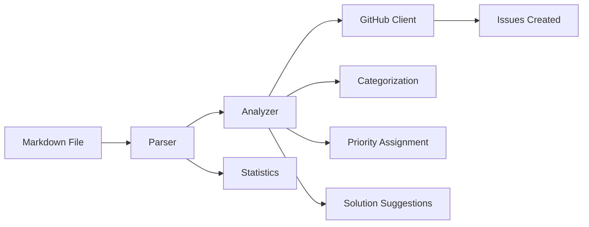

# mdiss - Markdown Issues

[](https://pypi.org/project/mdiss/)
[](https://pypi.org/project/mdiss/)
[](https://opensource.org/licenses/Apache-2.0)
[](https://github.com/wronai/mdiss/actions)
[](https://codecov.io/gh/wronai/mdiss)

**Automatyczne generowanie ticketów GitHub na podstawie plików markdown z błędami poleceń.**

## 🚀 Quick Start

```bash
# Instalacja
pip install mdiss

# Konfiguracja
mdiss setup

# Analiza pliku
mdiss analyze failures.md

# Tworzenie issues (dry run)
mdiss create failures.md owner repo --dry-run

# Tworzenie rzeczywistych issues
mdiss create failures.md owner repo
```

## ✨ Funkcje

- **🔍 Automatyczne parsowanie** - Wyodrębnia nieudane polecenia z plików markdown
- **🧠 Inteligentna analiza** - Określa priorytet i kategorię błędów
- **💡 Sugestie rozwiązań** - Automatyczne sugerowanie sposobów naprawy
- **🔗 GitHub Integration** - Bezpośrednie tworzenie issues z odpowiednimi labelami
- **🔐 Bezpieczny token management** - Automatyczne konfigurowanie uprawnień
- **🧪 Dry run mode** - Testowanie bez tworzenia rzeczywistych issues
- **📊 Export danych** - JSON, CSV, tabele
- **🎨 Rich CLI** - Kolorowy interfejs wiersza poleceń

## 📊 Analiza błędów

mdiss automatycznie kategoryzuje błędy i określa priorytety:

### Kategorie
- **dependencies** - Problemy z zależnościami (Poetry, npm)
- **missing-files** - Brakujące pliki
- **permissions** - Problemy z uprawnieniami
- **timeout** - Przekroczenie czasu wykonania
- **syntax** - Błędy składni (YAML, JSON)
- **configuration** - Problemy konfiguracji

### Priorytety
- **CRITICAL** - Segmentation faults, krytyczne błędy
- **HIGH** - Timeouts, problemy z dependencies
- **MEDIUM** - Standardowe błędy, brakujące pliki
- **LOW** - Drobne problemy

## 🏷️ Przykład wygenerowanego issue

**Tytuł:** `Fix failed command: Make target: install`

**Treść:**
```markdown
## Problem Description
Command `make install` is failing consistently.

**Priority**: HIGH  
**Category**: dependencies  
**Confidence**: 90%

### Error Analysis
🔍 **Root Cause**: Poetry lock file is out of sync with pyproject.toml...

### Suggested Solution
1. Run `poetry lock` to regenerate the lock file
2. Run `poetry install` to install dependencies
3. Commit the updated poetry.lock file
```

## 📖 Dokumentacja

- [Installation Guide](installation.md) - Szczegółowa instalacja i konfiguracja
- [Quick Start](quickstart.md) - Szybki start z przykładami
- [CLI Reference](cli.md) - Wszystkie komendy i opcje
- [API Reference](api.md) - Programowy interfejs
- [Examples](examples/basic.md) - Praktyczne przykłady użycia
- [Contributing](contributing.md) - Jak współpracować z projektem

## 🛠️ Format pliku markdown

mdiss rozpoznaje pliki w formacie:

```markdown
## X. Nazwa polecenia

**Command:** `polecenie`
**Source:** ścieżka/do/pliku
**Type:** typ_polecenia
**Status:** ❌ Failed
**Return Code:** kod_błędu
**Execution Time:** czas_w_sekundach

**Output:**
```
standardowy output
```

**Error Output:**
```
komunikaty błędów
```

**Metadata:**
- **klucz1:** wartość1
- **klucz2:** wartość2

---
```

## 🔄 Workflow



## 🧪 Przykład użycia

### Podstawowy workflow

```bash
# 1. Konfiguracja tokenu (jednorazowo)
mdiss setup

# 2. Analiza pliku z błędami
mdiss analyze build_failures.md

# 3. Podgląd issues (dry run)
mdiss create build_failures.md myorg myproject --dry-run

# 4. Tworzenie rzeczywistych issues
mdiss create build_failures.md myorg myproject
```

### Zaawansowane opcje

```bash
# Z dodatkowymi opcjami
mdiss create failures.md owner repo \
    --assignees "dev1,dev2" \
    --milestone 5 \
    --skip-existing \
    --token-file .github_token

# Export do różnych formatów
mdiss export failures.md --format json --output data.json
mdiss export failures.md --format csv --output report.csv

# Listowanie istniejących issues
mdiss list-issues owner repo --state open --labels "bug,high"
```

## 🔧 Integracja CI/CD

mdiss doskonale integruje się z systemami CI/CD:

```yaml
# .github/workflows/auto-issues.yml
name: Auto Issues
on:
  workflow_run:
    workflows: ["CI"]
    types: [completed]
    
jobs:
  create-issues:
    if: ${{ github.event.workflow_run.conclusion == 'failure' }}
    runs-on: ubuntu-latest
    steps:
      - uses: actions/checkout@v3
      - name: Install mdiss
        run: pip install mdiss
      - name: Create issues from failures
        run: |
          mdiss create failure_report.md \
            ${{ github.repository_owner }} \
            ${{ github.event.repository.name }}
        env:
          GITHUB_TOKEN: ${{ secrets.GITHUB_TOKEN }}
```

## 🤝 Programowy API

```python
from mdiss import MarkdownParser, GitHubClient, ErrorAnalyzer
from mdiss.models import GitHubConfig

# Parsowanie pliku
parser = MarkdownParser()
commands = parser.parse_file("failures.md")

# Analiza błędów
analyzer = ErrorAnalyzer()
for cmd in commands:
    analysis = analyzer.analyze(cmd)
    print(f"Priority: {analysis.priority.value}")
    print(f"Category: {analysis.category.value}")

# Tworzenie issues
config = GitHubConfig(token="...", owner="...", repo="...")
client = GitHubClient(config)

for cmd in commands:
    issue = client.create_issue_from_command(cmd)
    print(f"Created: {issue['html_url']}")
```

## 📈 Statystyki i raporty

mdiss generuje szczegółowe statystyki:

```bash
mdiss analyze large_failure_report.md
```

Przykładowy output:
```
📊 Statystyki:
  • Całkowita liczba poleceń: 84
  • Średni czas wykonania: 8.5s
  • Timeout'y: 6
  • Krytyczne błędy: 2

🔧 Typy poleceń:
  • make_target: 45
  • npm_script: 25
  • docker: 8
  • python: 4

🚨 Kody błędów:
  • 2: 35
  • 1: 28
  • 254: 12
  • -1: 6
```

## 🛡️ Bezpieczeństwo

- Token GitHub przechowywany lokalnie
- Automatyczna walidacja uprawnień
- Opcja dry-run do bezpiecznego testowania
- Nie przesyła wrażliwych danych

## 🔗 Przydatne linki

- [PyPI Package](https://pypi.org/project/mdiss/)
- [GitHub Repository](https://github.com/wronai/mdiss)
- [Issue Tracker](https://github.com/wronai/mdiss/issues)
- [Changelog](changelog.md)

---

**Stworzone przez [WRONAI Team](https://github.com/wronai)** ❤️